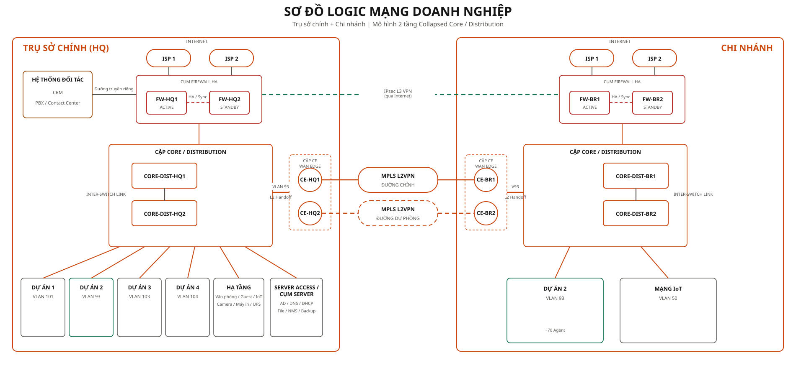
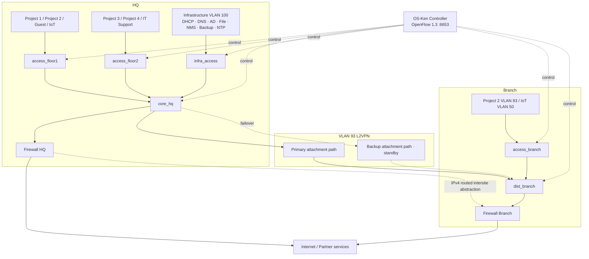
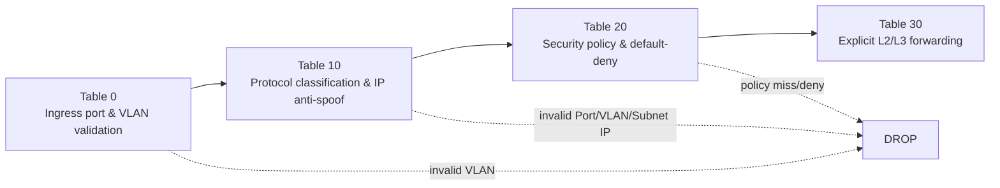

# Nghiên cứu, xây dựng và mô phỏng mô hình mạng doanh nghiệp ứng dụng SDN

[](https://github.com/manhhuy795/CCH_Network/actions/workflows/ci.yml)

`CCH_Network` là đồ án nghiên cứu và mô phỏng mạng doanh nghiệp Full-SDN gồm HQ, một Branch, hạ tầng dịch vụ, Firewall/Internet và Dashboard vận hành. OS-Ken điều khiển toàn bộ fabric gồm **6 Open vSwitch** bằng **OpenFlow 1.3**; CE, L2VPN bridge, firewall namespace và Internet/Partner zone nằm ngoài OpenFlow domain.

> Trạng thái nghiệm thu gần nhất: **24/24 Full-SDN unit tests** và **27/27 live traffic tests**. Live tests phải chạy trên Ubuntu với Mininet, OVS và quyền root; GitHub Actions chỉ chạy các gate không đặc quyền.

## Điểm nổi bật

| Thành phần | Hiện thực trong lab |
|---|---|
| SDN fabric | 6 OVS, OS-Ken, OpenFlow 1.3, `fail-mode=secure` |
| Pipeline | `Table 0 → 10 → 20 → 30` |
| Forwarding | L2 learning và L3 routing bằng explicit output; **không dùng `OFPP_NORMAL`** |
| VLAN | OpenFlow push/pop VLAN trên các đường đi cần gắn hoặc tháo thẻ |
| Segmentation | Default-deny, least privilege, cô lập Project/Guest/IoT/IT |
| Anti-spoofing | Ràng buộc `Port ↔ VLAN ↔ Subnet IP`; không tuyên bố static Port ↔ MAC binding |
| Dịch vụ mạng | DHCP Relay/DORA, Proxy ARP, L2/L3 forwarding |
| Session return | Cài flow chiều về động theo 5-tuple cho phiên được cho phép |
| Resilience | VLAN 93 tự động chuyển Primary/Backup khi attachment link bị fail/recover |
| Operations | FastAPI backend, React dashboard, health/flow/event/runtime evidence |

## Architecture — Kiến trúc Full-SDN





Sáu OVS được điều khiển là:

```text
access_floor1   access_floor2   core_hq
access_branch   dist_branch     infra_access
```

CE bridge, L2VPN bridge, firewall namespace, routed intersite abstraction và Internet/Partner zone không phải OpenFlow target.

## OpenFlow pipeline



- **Table 0** kiểm tra ingress port/VLAN và chỉ chuyển traffic hợp lệ sang Table 10.
- **Table 10** phân loại ARP/IPv4, thực thi anti-spoofing và chuyển nguồn hợp lệ sang Table 20.
- **Table 20** áp chính sách Project, Guest, IoT, IT Support và default-deny. Session hợp lệ có thể sinh dynamic 5-tuple return flow.
- **Table 30** cài forwarding L2/L3 theo đường đi với output port, VLAN push/pop, MAC rewrite và TTL decrement khi cần.

Mọi forwarding action đều tường minh; pipeline không dựa vào `OFPP_NORMAL`.

## VLAN và quy mô runtime

| VLAN | Zone | Subnet | Runtime |
|---:|---|---|---:|
| 50 | Branch IoT | `10.20.50.0/24` | 2 endpoint |
| 93 | Project 2, HQ + Branch | `10.10.93.0/24` | 20 user |
| 100 | Infrastructure services | `10.10.100.0/24` | 7 service |
| 101 | Project 1 | `10.10.101.0/24` | 20 user |
| 103 | Project 3 | `10.10.103.0/24` | 20 user |
| 104 | Project 4 | `10.10.104.0/24` | 20 user |
| 110 | IT Support | `10.10.110.0/24` | 10 user |
| 120 | Guest | `10.10.120.0/24` | 2 endpoint |
| 140 | HQ IoT | `10.10.140.0/24` | 5 endpoint |

Tổng corporate users trong runtime là **90**. VLAN 93 có gateway duy nhất `10.10.93.1` tại HQ; Branch không có SVI VLAN 93.

## Chính sách bảo mật

- Project 1/2/3/4 được phép giao tiếp trong cùng Project và bị chặn khi đi chéo Project.
- Guest chỉ được DHCP/DNS/NTP và General Internet; không được lateral vào mạng nội bộ.
- IoT chỉ được các bootstrap/monitoring service đã khai báo; không có broad Internet allow.
- IT Support được chủ động ICMP/SSH/RDP và các cổng quản trị được duyệt; user không được khởi tạo kết nối ngược vào VLAN 110.
- Traffic không khớp allow rule bị drop theo default-deny.
- DHCP Discover/Offer được relay giữa client access port và DHCP server tại `10.10.100.10`.

Mô hình áp dụng segmentation least-privilege cho lab, không tuyên bố một triển khai Zero Trust hoàn chỉnh.

## VLAN 93 Primary/Backup

```text
Primary: core_hq → CE-HQ1 → L2VPN Primary → CE-BR1 → dist_branch
Backup : core_hq → CE-HQ2 → L2VPN Backup  → CE-BR2 → dist_branch
```

Backup attachment path ở `standby/down` khi Primary hoạt động để tránh L2 loop. Khi control agent nhận fail/recover trên attachment link Primary, runtime đổi active path và purge flow liên quan. Đây là **attachment-link failover trong lab**, không phải carrier-grade protection signaling và không có cam kết thời gian hội tụ tức thời.

## Quick Start — Ubuntu 24.04

```bash
chmod +x sdn_mpls_demo/*.sh scripts/*.sh
sudo ./sdn_mpls_demo/setup_ubuntu_24_04.sh
./scripts/start_demo.sh --install
```

Khi demo, dùng ba terminal:

```bash
# Terminal 1 — OS-Ken
./sdn_mpls_demo/run_controller.sh

# Terminal 2 — Mininet topology
sudo ./sdn_mpls_demo/run_topology.sh

# Terminal 3 — Dashboard
./scripts/start_demo.sh
```

- Dashboard: `http://127.0.0.1:5173`
- Backend/API docs: `http://127.0.0.1:8000/docs`

## Demo

Kịch bản bảo vệ 5–10 phút: [DEMO_SCRIPT.md](DEMO_SCRIPT.md). Kịch bản đi từ kết nối 6 OVS, kiểm tra không có `OFPP_NORMAL`, pipeline bốn bảng và policy matrix đến DHCP DORA, VLAN 93 failover, Dashboard và hai bộ test nghiệm thu.

## Testing

```bash
# 24 Full-SDN unit cases
python -m pytest -q tests/test_full_sdn_fabric.py

# Toàn bộ Python/backend/contract tests
python -m pytest -q

# Frontend
npm ci --prefix dashboard/frontend
npm run lint --prefix dashboard/frontend
npm run test --prefix dashboard/frontend
npm run typecheck --prefix dashboard/frontend
npm run build --prefix dashboard/frontend

# 27 live traffic cases — chỉ khi Ubuntu runtime đang chạy
sudo -E sdn_mpls_demo/.venv/bin/python sdn_mpls_demo/run_live_tests.py
```

GitHub Actions chạy unit, backend/contract và frontend jobs. Mininet/OVS/root live integration được loại khỏi GitHub-hosted runner và phải chạy trên Ubuntu lab/self-hosted runner.

Chi tiết acceptance: [docs/testing_and_acceptance.md](docs/testing_and_acceptance.md).

## Source of truth

```text
vars/network_model.yml
vars/vlans.yml
vars/routing.yml
vars/acl_policies.yml
vars/firewall_policies.yml
vars/interface_mapping.yml
sdn_mpls_demo/policy.yml
```

Luồng triển khai:

```text
Source of truth → validation/policy engine → Mininet + OVS + OS-Ken
                → FastAPI backend → React dashboard → runtime evidence
```

## Cấu trúc repository

```text
sdn_mpls_demo/       Topology Full-SDN, controller, policy engine, live tests
dashboard/backend/   FastAPI runtime API
dashboard/frontend/  React/Vite dashboard
vars/                Network source of truth
scripts/             Validation, automation và runtime gates
tests/               Unit, backend và contract tests
docs/                Kiến trúc, vận hành, bảo mật và acceptance
```

## Limitations

- Lab chỉ hỗ trợ **IPv4**; IPv6 bị drop tại ingress.
- Failover chỉ tác động attachment link/path VLAN 93 do control agent quản lý.
- CE/MPLS và IPsec là runtime abstraction; không chứng minh MPLS provider control plane hoặc IKE/ESP/XFRM encryption.
- Flow priority cho Voice không đồng nghĩa với queue/DSCP hay end-to-end QoS.
- Anti-spoofing là `Port ↔ VLAN ↔ Subnet IP`, không phải static MAC binding.
- Đây là mô hình nghiên cứu/mô phỏng, **chưa production-ready**.
