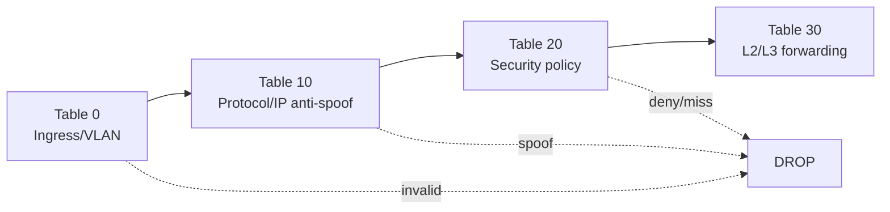

# Kiến trúc hệ thống Full-SDN

## Phạm vi

CCH_Network mô phỏng mạng doanh nghiệp gồm HQ, một Branch, vùng Infrastructure, Firewall/Internet và Partner services. OS-Ken điều khiển **6 OVS** bằng OpenFlow 1.3. Đây là lab nghiên cứu IPv4, chưa phải cấu hình production.

## Các lớp kiến trúc

| Lớp | Thành phần |
|---|---|
| Source of truth | `vars/network_model.yml`, VLAN/routing/ACL/firewall/interface mapping |
| Data plane | Mininet hosts, 6 OVS, CE/L2VPN Linux bridges, firewall namespaces |
| Control plane | OS-Ken tại `127.0.0.1:6653`, OpenFlow 1.3 |
| Policy | `sdn_mpls_demo/policy.yml`, default-deny và least privilege |
| Operations | FastAPI, React dashboard, control-agent socket và runtime reports |

## SDN domain

Các OVS được controller quản lý:

```text
HQ:     access_floor1, access_floor2, core_hq, infra_access
Branch: access_branch, dist_branch
```

Các thành phần ngoài SDN domain: CE bridge, L2VPN Primary/Backup bridge, `fw_hq`, `fw_telesale`, routed intersite abstraction và Internet/Partner zone.

## Data path

- L2 trong cùng VLAN: access OVS → explicit multi-hop forwarding → access OVS.
- L3 liên VLAN được phép: Proxy ARP/virtual gateway → MAC rewrite, TTL decrement và explicit output.
- Internet/Partner: user fabric → firewall namespace của site → service zone.
- Routed intersite ngoài VLAN 93: firewall HQ → IPv4 routed abstraction → firewall Branch.
- VLAN 93: HQ và Branch dùng cùng broadcast domain; gateway `10.10.93.1` chỉ đặt tại HQ.

## OpenFlow pipeline



Pipeline không dùng `OFPP_NORMAL`. VLAN push/pop, L2/L3 forwarding và output port được thể hiện bằng OpenFlow actions.

## Security boundary

- Port/VLAN/source subnet phải khớp source of truth.
- Project VLANs bị cách ly lẫn nhau.
- Guest, IoT và IT Support chỉ có quyền đã khai báo.
- Table 20 dùng default-deny.
- Flow chiều về động được giới hạn theo 5-tuple của phiên hợp lệ.
- Không tuyên bố static Port ↔ MAC binding hoặc một triển khai Zero Trust hoàn chỉnh.

## VLAN 93 resilience

Primary và Backup là hai attachment paths riêng. Backup ở standby để tránh L2 loop. Control agent tự đổi active path khi Primary attachment link bị fail/recover và controller purge flow VLAN 93 liên quan. Cơ chế này không chứng minh carrier protection signaling và không cam kết hội tụ tức thời.

## Giới hạn

- IPv4-only; IPv6 bị drop.
- CE/MPLS/IPsec chỉ là runtime abstraction.
- Không có provider MPLS control plane, IKE/ESP/XFRM, appliance HA hay physical MLAG/FHRP proof.
- Voice flow priority không phải end-to-end QoS.
- Lab chưa production-ready.
