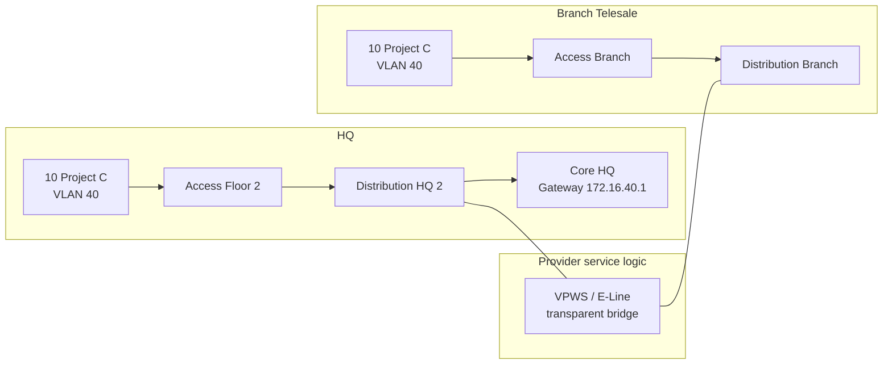

# Thiết kế MPLS L2VPN logic cho VLAN 40 – Project C

## 1. Yêu cầu nghiệp vụ và quyết định thiết kế

Project C có 20 người dùng nhưng phải làm việc trong cùng một miền Ethernet tại hai địa điểm:

| Thuộc tính | HQ | Branch Telesale |
|---|---:|---:|
| Số endpoint Project C | 10 | 10 |
| VLAN | 40 | 40 |
| Subnet | 172.16.40.0/24 | 172.16.40.0/24 |
| Default gateway | 172.16.40.1 tại HQ | Dùng gateway tại HQ qua L2VPN |
| Access switch | `access_floor2` | `access_branch` |

Vì hai phía cần giữ nguyên VLAN và subnet, dịch vụ phù hợp là Ethernet L2VPN dạng VPWS/E-Line. Các VLAN còn lại vẫn được định tuyến qua mô hình MPLS L3VPN logic Primary/Backup.

## 2. Luồng dữ liệu



Broadcast, ARP và unicast Ethernet của VLAN 40 được chuyển trong suốt qua `l2vpn_vpws40`. Branch không tạo SVI VLAN 40 và không quảng bá `172.16.40.0/24` vào L3VPN. Mọi traffic cần định tuyến hoặc Internet của Project C tại Branch đi qua gateway tập trung ở HQ.

## 3. Phạm vi mô phỏng trung thực

Runtime dùng Linux bridge độc lập `l2vpn40` nối hai attachment circuit:

- HQ: `dist_hq_2:d2-eth40` ↔ `l2vpn40:pw40-hq`;
- Branch: `dist_branch:bd-eth40` ↔ `l2vpn40:pw40-br`;
- hai cổng OVS phía khách hàng được gán access VLAN 40;
- bridge không do SDN Controller quản lý, phù hợp vai trò dịch vụ carrier nằm ngoài miền điều khiển của doanh nghiệp.

Đây là mô phỏng logic forwarding Ethernet, không phải một MPLS core thật. Đồ án không tuyên bố đã mô phỏng MPLS label stack, LDP/RSVP-TE, MP-BGP signaling, pseudowire control word hoặc PE/P router. Cách ghi rõ giới hạn này quan trọng hơn việc gắn nhãn “MPLS” cho một bridge thông thường.

## 4. Tiêu chí nghiệm thu

| ID | Kiểm tra | Kết quả mong đợi |
|---|---|---|
| L2-01 | `h40_01` ping `h40_11` | Thành công khi hai attachment circuit UP |
| L2-02 | ARP của `h40_11` tìm `172.16.40.1` | Học MAC gateway từ HQ qua VPWS |
| L2-03 | Kiểm tra SVI VLAN 40 tại Branch | Không tồn tại |
| L2-04 | Kiểm tra route L3VPN tại Branch/CE | Không có `172.16.40.0/24` |
| L2-05 | Hạ `dist_branch-l2vpn_vpws40` | Liên lạc VLAN 40 xuyên site thất bại |
| L2-06 | Khôi phục attachment circuit | Liên lạc hoạt động lại sau khi MAC/ARP hội tụ |
| L2-07 | Project C truy cập Project A/B | Bị chặn theo SDN isolation policy |
| L2-08 | Project C Branch ra Internet | Đi qua gateway và firewall HQ |

Chạy kiểm tra tĩnh trước demo:

```bash
python3 scripts/validate_vars.py
python3 -m pytest -q tests/test_vlan40_l2vpn_vpws.py
python3 scripts/generate_configs.py
```

Trên Ubuntu có Mininet/OVS, dùng dashboard hoặc control API để hạ/khôi phục link `dist_branch-l2vpn_vpws40`, đồng thời capture ARP/ICMP ở `pw40-br` để tạo bằng chứng runtime.

## 5. Rủi ro và phương án production

Kéo dài L2 làm tăng failure domain và đưa broadcast qua WAN. Khi triển khai thật cần chốt với carrier các tham số MTU, QoS, bandwidth/CIR, MAC limit, storm-control, loop prevention, OAM và SLA. Gateway tập trung tại HQ cũng khiến Project C tại Branch phụ thuộc WAN; nếu nghiệp vụ yêu cầu khả dụng cao, cần thiết kế gateway HA và pseudowire redundancy có cơ chế chống loop rõ ràng.

Trong báo cáo, nên so sánh VPWS với VXLAN/EVPN hoặc định tuyến L3 thuần. Lý do chọn VPWS ở đây là yêu cầu bắt buộc giữ cùng VLAN/subnet, phạm vi chỉ có hai site và ưu tiên một E-Line đơn giản, không phải vì L2 stretch luôn là kiến trúc tốt nhất.
